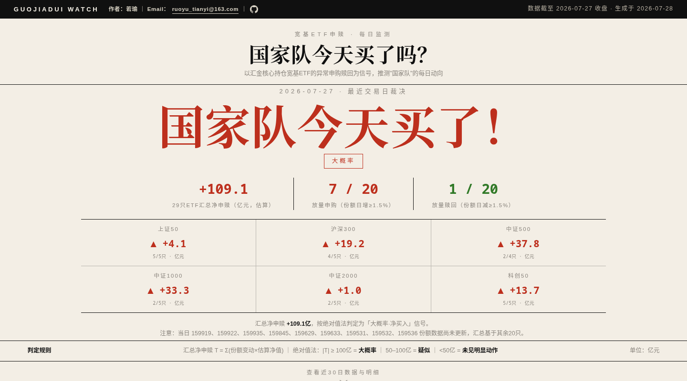

# GuoJiaDui-Watch [ARCHIVED — Demo]

> **项目状态：已封存（Archive）**
> 
> 本仓库当前作为 Demo 永久封存，不再执行自动数据更新。以下 README 保留原始功能说明，并在末尾补充了后续后端部署计划与重启路径。

---

国家队今天买了吗？—— 用宽基ETF申赎数据追踪"国家队"动向的可视化页面。

## 这是什么

一个纯静态单页网站（`index.html`），通过监测六大方向宽基ETF的每日申购赎回，推测中央汇金（"国家队"）是否入场。结论直接、可视化清晰：买了就红字大字"国家队今天买了！"，没买就是"没动手"。



## 判定方法

1. **监测篮子**：覆盖上证50、沪深300、中证500、中证1000、中证2000、科创50六大方向，每个方向取规模前5的ETF（中证500全市场超50亿的仅4只，按实际纳入），共29只。创业板不纳入监测。
2. **净申赎估算**：`T = Σ(当日份额变动 × 当日估算净值)`，单位亿元；净值用"基金规模 ÷ 总份额"近似。
3. **分类呈现**：不按总市值汇总，而是按指数方向分类汇总——50、300、500、1000、2000、科创50各自的净申购/净赎回。
4. **绝对值法判定**：
   - `T ≥ +100亿` → **大概率买了**
   - `+50亿 ≤ T < +100亿` → **疑似净买入**
   - `T ≤ -100亿` → **大概率卖了**
   - `-100亿 < T ≤ -50亿` → **疑似净卖出**
   - `|T| < 50亿` → **未见明显动作**

ETF份额数据T+1披露，页面结论始终对应"最近一个有完整数据的交易日"。深市ETF（159开头）通常比沪市晚半天，页面会明确标注当日数据缺失的只数。

## 数据源

[恒生聚源 Gildata](https://www.gildata.com) —— ETF基金份额变动表（`gildata_fin_query` 接口）。

**注意**：聚源数据本身有版权，仓库中的 `data_sample.csv` 是脱敏样例（仅保留结构），请勿直接分发原始数据文件。

## 本地运行

```bash
# 直接打开页面（数据已内置在 index.html 中）
open index.html

# 或起个本地服务
python3 -m http.server 8000
# 访问 http://localhost:8000
```

## 更新数据（已停用）

```bash
# 以下命令仍可在本地手动执行，但不再有定时任务自动触发
export KIMI_API_KEY=your_key   # 或配置 ~/.kimi/agent-gw.json
python3 scripts/fetch_data.py
```

脚本会重新抓取29只ETF的份额变动、重算分类汇总和判定结论，并把新数据注入 `index.html`。

## 文件结构

```
├── index.html          # 单页网站（含数据）
├── scripts/
│   ├── fetch_data.py   # 数据抓取与更新脚本
│   └── auto_update.py  # 自动化入口（已停用）
├── data_sample.csv     # 脱敏样例数据
└── README.md
```

## 局限

- 申赎来自全部市场参与者，异常放量只是国家队行为的**间接代理指标**，套利资金、机构调仓同样会造成大额申赎
- 数据为页面生成时点的静态快照，不会自动更新，需手动跑脚本
- 不构成任何投资建议

## License

MIT — 页面与代码可自由使用，数据部分请遵守聚源相关协议。

---

## 后端后续部署计划 & 重启路径

本项目当前作为 Demo 封存，**原 Kimi Work 定时 Automation 已取消**。若未来决定重启，建议按以下路径演进：

### 阶段一：零成本自动化（推荐优先实现）

**目标**：把现有的本地脚本跑通为全自动、零运维的 CI/CD 流程。

| 组件 | 当前状态 | 目标方案 |
|------|---------|---------|
| 定时任务 | Kimi Work Automation（已删除） | **GitHub Actions `schedule` trigger**（免费 cron，如每日 UTC 01:00 运行） |
| 数据抓取 | 本地调用 Gildata Python 脚本 | 同上，在 Actions runner 中执行（需解决 Gildata 工具/凭证在 CI 环境中的可用性） |
| 部署托管 | 本地打开 HTML 文件 | **GitHub Pages**（推送即自动部署，完全免费） |

**具体实施步骤**：
1. 在 `.github/workflows/` 下新建 `update.yml`：
   - `on: schedule: - cron: '0 1 * * *'`（北京时间每日 09:00）
   - `jobs: update` 中检出仓库 → 安装 Python 依赖 → 运行 `scripts/fetch_data.py` → 如有变更则 `git commit` + `git push`
2. 在仓库 Settings > Pages 中启用 GitHub Pages（Source: Deploy from a branch → `main` / `/ (root)`）
3. 访问 `https://<user>.github.io/GJD-watch` 即可查看实时页面
4. **关键卡点**：Gildata 工具目前依赖本地绝对路径（`C:/Users/.../gildata_tool.py`）且需网关凭证。重启前需确认：
   - 该工具是否支持无头/CI 环境运行；或
   - 替换为 Wind / iFinD / 其他支持 API Key 直接调用的数据源

### 阶段二：前后端分离（数据量增大或需要历史查询时）

**目标**：前端静态部署 + 后端数据 API，支持历史回溯、筛选、对比。

| 组件 | 方案选项 | 估算成本 |
|------|---------|---------|
| 前端托管 | Vercel / Cloudflare Pages / GitHub Pages | 免费档足够 |
| 后端 API | Cloudflare Workers / Vercel Edge Functions | 免费档足够（每日 1 次抓取 + 轻量查询） |
| 数据存储 | 方案 A：SQLite + Git 仓库（无额外服务）<br>方案 B：D1 / Turso / Supabase 托管数据库 | A: 免费；B: 免费档足够 |
| 定时爬虫 | GitHub Actions 继续承担，抓完后调用后端 API 写入数据库 | 免费 |

**实施步骤**：
1. 将 `fetch_data.py` 改造为仅输出 JSON（不再注入 HTML），并通过 HTTP POST 推送到后端 API
2. 后端使用 Cloudflare Worker + D1（或 Vercel + Turso）存储每日快照
3. 前端改为调用 API 获取数据，支持日期选择、历史对比
4. 优势：HTML 与数据解耦，页面加载更快，支持历史查询

### 阶段三：监控与告警（可选）

- 在阶段二后端基础上，增加异常检测：
  - 某方向单日净申购/净赎回超过阈值 → 发邮件/钉钉/飞书告警
  - 连续 N 日同方向大额流动 → 升级告警级别
- 可使用 Cloudflare Workers Cron Triggers 或 GitHub Actions + `curl` 调用告警 Webhook

### 重启检查清单

- [ ] 确认数据源可用性（Gildata / Wind / iFinD 在 CI/无头环境是否可调用）
- [ ] 获取/配置 API 凭证（网关 token 或直连 API key）
- [ ] 选择阶段一或阶段二架构
- [ ] 恢复/重写 GitHub Actions workflow
- [ ] 启用 GitHub Pages（或 Vercel/Cloudflare Pages）
- [ ] 验证端到端：定时触发 → 抓取 → 计算 → 提交 → 部署 → 页面更新

> **封存日期**：2026-08-10  
> **最后数据更新**：见 `index.html` 中 `DATA.generated` 字段  
> **重启时请联系**：维护者或重新启用 GitHub Actions 即可恢复自动更新。
